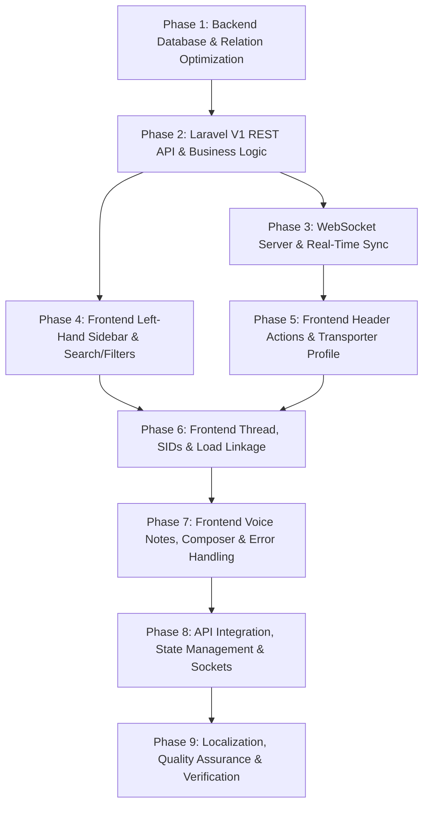

# PDS 961 — Shipper UI Revamp: Chat & Messaging Module
## Complete Phase-Wise Architecture & Implementation Plan (Backend & Frontend)

---

## Executive Summary

This document provides the comprehensive, production-grade technical specification and phase-wise implementation plan for **PDS 961: Shipper UI Revamp - Chat & Messaging Module**.

The objective of this revamp is to align the React Shipper Web Panel (`shipper_react`) and the Laravel Backend API (`MV_Backend_API`) with the latest design standards, feature parity from the legacy Laravel blade panel, and enhanced real-time communication capabilities.

---

## High-Level Architecture Diagram

```
┌────────────────────────────────────────────────────────────────────────────────────────────────────────┐
│                                           REACT SHIPPER PANEL                                          │
│                                            (shipper_react)                                             │
├─────────────────────────────────────┬──────────────────────────────────────────────────────────────────┤
│           LEFT-HAND PANE            │                         RIGHT-HAND PANE                          │
│  - Multi-Field Deep Search          │  - Clean Header (No "Last Seen", No Search Icon)                 │
│    (Messages, SIDs, Partner Names)  │  - Partner Tags ("Company", "Freelancer", "Company Driver")      │
│  - Filters: All, Unread, Carriers,  │  - Interactive Phone & Email Popovers with 1-Click Copy          │
│    Freelancers, Partners            │  - Direct Link to Transporter Profile (Rating, Reviews, KPIs)    │
│    (Removed: "Needs Action")        │  - Chronological SID Filter Dropdown (Most Recent on Top)        │
│  - Chat Previews: Avatar, Role Tag, │  - "Chat Linked To [SID]" Oval Header & Hyperlink to Load Detail │
│    Name, Last Message, Timestamp,   │  - Message Bubbles without Ticks / Read Receipts                 │
│    Latest SID Chip, Unread Badge    │  - "Linked to SID-xxx" Bar above Composer                        │
│                                     │  - Attachments + Quick Templates + Voice Note Recording/Playback │
│                                     │  - Error Handling: "Message Failed to Send" Popup & Retry        │
└──────────────────────────────────┬──┴────────────────────────────────┬─────────────────────────────────┘
                                   │ REST API (Sanctum Bearer)         │ WebSockets & Firebase FCM
                                   ▼                                   ▼
┌────────────────────────────────────────────────────────────────────────────────────────────────────────┐
│                                          LARAVEL BACKEND API                                           │
│                                           (MV_Backend_API)                                             │
├────────────────────────────────────────────────────────────────────────────────────────────────────────┤
│  - ChatController (V1 Shipper API: Conversations, History, Send, Read, Upload Voice, Upload Media)     │
│  - Active Shipment & Relationship Gateways (Ontrip, Fulfilled, Bids, Private Partners, Subscription)  │
│  - TransporterProfileController (Average Rating, Reviews, Performance KPIs)                            │
│  - Node.js / TypeScript Socket Server (`socket/src/controllers/ChatController.ts`)                     │
│  - S3 / Storage Voice Note Storage (`upload-voice`) & Audio Transcoding Support                        │
└────────────────────────────────────────────────────────────────────────────────────────────────────────┘
```

---

## Detailed Requirement Breakdown & Feature Mapping

| Requirement Item | UI Location / Subsystem | Current State | Target State (PDS 961) |
|---|---|---|---|
| **Search Bar** | Left-Hand Sidebar | Basic name/chip search in client memory | Full deep-search across message content, shipment SIDs, and transporter / partner names |
| **Filters** | Left-Hand Sidebar | All, Unread, Carriers, Freelancers, Needs Action | **Keep**: All (default), Unread, Carriers, Freelancers.<br>**Add**: “Partners”.<br>**Remove**: “Needs Action”. |
| **Chat Previews** | Left-Hand Sidebar | Basic preview card | Name of account, last message timestamp, last message snippet preview, latest associated SID chip, unread badge, partner role badge |
| **"Last Seen Today"** | Right-Hand Header | Shown as subtitle (e.g. `Last seen today 09:56`) | **Removed** from the header |
| **Transporter Badges** | Right-Hand Header | Minimal badge | Visible tags next to name: `Company`, `Freelancer`, `Company Driver` |
| **Phone Number Icon** | Right-Hand Header | Direct `tel:` link trigger | Click opens tooltip/popover displaying phone number + 1-click Copy to clipboard |
| **Email Icon** | Right-Hand Header | Direct `mailto:` trigger | Click opens tooltip/popover displaying email address + 1-click Copy to clipboard |
| **Profile Icon** | Right-Hand Header | Placeholder toast | Opens full Transporter Profile modal with average ratings, star distribution, reviews list, and performance KPIs |
| **Header Search Icon**| Right-Hand Header | Present (opens search modal) | **Removed** (search is consolidated in left sidebar) |
| **SID Filter Dropdown**| Right-Hand Context Bar | Basic hardcoded dropdown | Lists all SIDs present in the chat chronologically (most recent on top) |
| **Export Button** | Right-Hand Context Bar | Present (`Export transcript` button) | **Removed** from chat interface |
| **Load Start Oval** | Message Thread Stream | Says `Conversation with [username]` | Displays `Chat Linked To [SID-XXXXX]` with clickable link to shipment detail |
| **SID Hyperlinking** | Thread & Banners | Plain text / static chip | Hyperlinked directly to `/manage-shipments?sid=...` or shipment detail view |
| **Composer SID Bar** | Above Message Input | Exists as static snippet | Kept as `Linked to [SID-XXXXX]` for quick access with latest SID in chat |
| **Attachment Button**| Message Composer | Basic file input | Kept with document/image upload support & preview chip |
| **Quick Templates** | Message Composer | Template dropdown | Kept with dynamic placeholder interpolation |
| **Voice Note Button**| Message Composer | Missing in React (existed in Blade) | **Added**: Full Record, Timer, Cancel, Stop & Preview, Discard, Send, and in-thread Audio Player |
| **Read Receipt Ticks**| Message Meta | Sent messages show single/double check ticks | **Removed** (clean timestamp only) |
| **Send Error Handling**| Message Dispatch | Fails silently / mock fallback | Shows instant error popup: *"Message failed to send. Please check your connection and try again."* with retry |

---

## Phase-Wise Implementation Plan



---

### Phase 1: Backend Database & Schema Standardization

#### 1.1 Existing Database Structure Review
The database stores chat messages in the `messages` table:
```sql
CREATE TABLE `messages` (
  `id` bigint(20) UNSIGNED NOT NULL AUTO_INCREMENT,
  `shipment_id` bigint(20) UNSIGNED DEFAULT NULL,
  `senderable_id` bigint(20) UNSIGNED NOT NULL,
  `senderable_type` varchar(255) COLLATE utf8mb4_unicode_ci NOT NULL,
  `receiverable_id` bigint(20) UNSIGNED NOT NULL,
  `receiverable_type` varchar(255) COLLATE utf8mb4_unicode_ci NOT NULL,
  `message` text COLLATE utf8mb4_unicode_ci NOT NULL,
  `messages_type` enum('text','voice','media','system') COLLATE utf8mb4_unicode_ci DEFAULT 'text',
  `duration` varchar(50) COLLATE utf8mb4_unicode_ci DEFAULT NULL,
  `read_at` timestamp NULL DEFAULT NULL,
  `deleted_at` timestamp NULL DEFAULT NULL,
  `created_at` timestamp NULL DEFAULT NULL,
  `updated_at` timestamp NULL DEFAULT NULL,
  PRIMARY KEY (`id`),
  KEY `messages_senderable_index` (`senderable_type`, `senderable_id`),
  KEY `messages_receiverable_index` (`receiverable_type`, `receiverable_id`),
  KEY `messages_shipment_id_index` (`shipment_id`)
) ENGINE=InnoDB DEFAULT CHARSET=utf8mb4 COLLATE=utf8mb4_unicode_ci;
```

#### 1.2 Query Optimization & Indexing
- Ensure compound index for fast conversation retrieval:
  `INDEX `idx_messages_conversation` (`senderable_type`, `senderable_id`, `receiverable_type`, `receiverable_id`, `created_at`)`
- Support morph type alias mapping (`shipper` -> `App\Models\Shipper`, `carrier` -> `App\Models\Carrier`, `driver` -> `App\Models\Driver`).
- Partner relationship verification: query `partners` / `shipment_partners` table to determine if a carrier/driver is an accepted partner for the authenticated shipper.

---

### Phase 2: Laravel V1 REST API & Business Logic (`MV_Backend_API`)

#### 2.1 API Route Registration (`routes/api/shipper.php`)
```php
Route::prefix('chat')->name('api.shipper.chat.')->group(function () {
    Route::get('conversations', [ChatController::class, 'conversations'])->name('conversations');
    Route::get('history/{type}/{id}', [ChatController::class, 'history'])->name('history');
    Route::post('send', [ChatController::class, 'sendMessage'])->name('send');
    Route::post('upload-voice', [ChatController::class, 'uploadVoice'])->name('upload-voice');
    Route::post('upload-attachment', [ChatController::class, 'uploadAttachment'])->name('upload-attachment');
    Route::post('read', [ChatController::class, 'markAsRead'])->name('read');
});
```

#### 2.2 Controller Architecture: `App\Http\Controllers\Api\Shipper\V1\Chat\ChatController.php`

1. **`conversations(Request $request)`**:
   - Fetches distinct conversation threads for the authenticated shipper.
   - **Filter Support**:
     - `all`: All active contacts.
     - `unread`: Contacts with `unread_count > 0`.
     - `carrier`: Contacts where actor is a Carrier company.
     - `freelancer`: Contacts where actor is an independent Driver (`company_id IS NULL`).
     - `partner`: Contacts with accepted partner status in `partners` table.
   - **Search Query (`search`)**:
     - Substring match on transporter name (`first_name`, `last_name`, `company_name`).
     - Substring match on last message text or any message text in the thread.
     - Substring match on associated shipment SIDs (`SID-XXXXX` or `shipments.id`).
   - **Response Payload**:
     ```json
     {
       "status": true,
       "data": [
         {
           "id": "carrier_8",
           "partner_id": 8,
           "type": "carrier",
           "partner_role": "company",
           "name": "KRP Transport S.A",
           "initials": "KT",
           "avatar_url": "https://...",
           "phone": "+30 210 555 9900",
           "email": "dispatch@krp-transport.com",
           "unread": 2,
           "last_msg": "Urgent: truck broke down near Lamia",
           "last_time": "Today 09:30",
           "latest_sid": "SID-77455",
           "sids": ["SID-77455", "SID-77460"],
           "is_partner": true,
           "online": true
         }
       ]
     }
     ```

2. **`history(Request $request, string $type, int $id)`**:
   - Verifies subscription permissions (`chat_with_carriers_drivers`).
   - Validates active shipment relation / pending bids / partner relationship (`enable_chat`).
   - Retrieves message list ordered chronologically with morph relations.
   - Computes unique chronological SIDs list for the conversation filter.
   - Automatically marks incoming messages as read.

3. **`uploadVoice(Request $request)`**:
   - Validates audio file: `audio` (mime: `wav, m4a, mp3, webm, ogg, mp4, caf`, max: 10MB).
   - Generates unique hash, stores to S3 disk under `chat-voices/`, sets public visibility.
   - Returns public audio URL.

4. **`uploadAttachment(Request $request)`**:
   - Validates media/document: max 15MB.
   - Stores to S3 disk under `chat-attachments/`.
   - Returns file name, file size, MIME type, and public URL.

5. **`sendMessage(Request $request)`**:
   - Validates `receiver_id`, `receiver_type`, `message`, `messages_type` (`text` | `voice` | `media`), optional `shipment_id`, optional `duration`.
   - Creates `Message` model record.
   - Pushes real-time payload to WebSocket and triggers Firebase FCM push notification.

---

### Phase 3: WebSocket Server & Real-Time Sync (`MV_Backend_API/socket`)

#### 3.1 Node.js / TypeScript Socket Server Enhancements
- Review `MV_Backend_API/socket/src/controllers/ChatController.ts`.
- Ensure proper room joining: `socket.join('shipper_' + shipper_id)`.
- Emit events:
  - `send_message`: Dispatched to recipient room and sender room for instant acknowledgement.
  - `typing_indicator`: Dispatches typing status.
  - `read_message`: Notifies sender when recipient reads message.
- Exception handling: If message persistence fails, emit `send_message_failed` event with error reason to trigger the client-side error popup.

---

### Phase 4: Frontend React - Left-Hand Sidebar (Search & Filters)

#### 4.1 Multi-Field Deep Search Implementation
- In `ConversationList.tsx` and `useMessages.ts`:
  - Search input queries across:
    1. Transporter Account Name / Company Name.
    2. Message Content (both latest preview and historical thread messages).
    3. Associated Shipment SIDs (e.g. searching `"77478"` or `"SID-77478"` immediately finds the associated conversation).

#### 4.2 Updated Filter Pills
- Update `MessageFilterType = 'all' | 'unread' | 'carrier' | 'freelancer' | 'partner'`.
- Remove `Needs Action` filter button and references.
- Add `Partners` filter pill with badge count showing active partner chats.
- Maintain dynamic count badges on filter pills.

#### 4.3 Conversation Card Preview Enhancements
- Each conversation item in `ConversationList.tsx` renders:
  - Avatar with online indicator and partner role badge (`Company`, `Freelancer`, `Company Driver`).
  - Name and formatted timestamp (`Today 10:12` or `02/01 10:12`).
  - Snippet preview (with 🎙️ icon indicator if voice message).
  - Latest associated SID chip (e.g. `SID-77478`).
  - Unread count badge (vibrant purple badge).

---

### Phase 5: Frontend React - Header Actions & Transporter Profile

#### 5.1 Clean Header Layout (`ChatHeader.tsx`)
- **Remove Subtitle**: Remove `getLastSeenText()` / "Last seen today".
- **Remove Search Icon**: Remove search button from header actions.
- **Transporter Type Tags**: Render prominent badge next to account name (`Company`, `Freelancer`, `Company Driver`).

#### 5.2 Interactive Phone & Email Popovers with Copy-to-Clipboard
- **Phone Button**:
  - Clicking triggers a floating popover showing the contact phone number (e.g. `+30 694 123 4567`).
  - Features a "Copy Phone" button with `navigator.clipboard.writeText()`.
  - Visual feedback: Icon switches to checkmark + Toast: *"Phone number copied to clipboard"*.
- **Email Button**:
  - Clicking triggers a floating popover showing the email address (e.g. `dispatch@krp-transport.com`).
  - Features a "Copy Email" button.
  - Visual feedback: Icon switches to checkmark + Toast: *"Email address copied to clipboard"*.

#### 5.3 Transporter Profile Integration
- **Profile Icon**:
  - Connect to `useTransporterProfile()` context hook:
    ```tsx
    const { openTransporterProfile } = useTransporterProfile();
    // ...
    <button
      type="button"
      className="ch-btn"
      title="View Transporter Profile"
      onClick={() => openTransporterProfile({
        id: conversation.partnerId,
        type: conversation.type === 'company' ? 'carrier' : 'driver',
        name: conversation.name,
      })}
    >
      <User size={16} />
    </button>
    ```
  - Directly opens the full Transporter Profile modal featuring:
    - Overall average star rating & total review count.
    - 5-star to 1-star percentage distribution bars.
    - Performance KPI cards: On-Time Delivery %, Cancellation Rate %, Avg Pickup Delay (min).
    - Verified shipper reviews list with timestamps and comments.

---

### Phase 6: Frontend React - Chat Thread, SIDs & Load Linkage

#### 6.1 Chronological SID Filter Dropdown
- In `ChatThread.tsx`:
  - Context filter bar dropdown lists all SIDs associated with the current conversation chronologically, with the most recent SID at the top.
  - Options:
    - `All Messages` (default).
    - `SID-77501 — Athens → Thessaloniki` (Most recent).
    - `SID-77478 — Patras → Athens` (Older).
  - Selecting a SID filters the thread stream to messages associated with that shipment.

#### 6.2 Removal of Export Button
- Remove the `Export transcript` / Download button from the chat context filter bar in `ChatThread.tsx`.

#### 6.3 "Chat Linked To [SID]" Load Start Oval
- Replace the legacy generic `Conversation with [username]` divider with a stylized blue oval badge:
  - Displays `Chat Linked To SID-XXXXX`.
  - The SID is hyperlinked; clicking navigates directly to the shipment detail page (`/manage-shipments?sid=...`).

#### 6.4 Removal of Read Receipt Ticks
- In `ChatThread.tsx`, remove the checkmark icons (`Check` / `CheckCheck` / ticks) next to message timestamps.
- Clean metadata displaying only the timestamp (`10:23`).

#### 6.5 Composer Linked SID Bar
- Maintain the `Linked to SID-XXXXX · Origin → Destination` bar right above the text input.
- Hyperlink the SID tag with cursor pointer and hover effects for instant navigation to the load details.

---

### Phase 7: Frontend React - Composer, Voice Notes & Error Handling

#### 7.1 Voice Note Recording Engine (`ChatComposer.tsx` & `VoicePlayer.tsx`)
- Implement HTML5 `MediaRecorder` audio capture hook (`useVoiceRecorder.ts`):
  1. **Idle State**: Microphone icon button in composer toolbar.
  2. **Recording State**:
     - Pulsing red recording dot.
     - Live elapsed timer (`00:00` -> `00:15`).
     - Trash / Cancel button (discards recording without saving).
     - Stop & Preview button (stops recording and switches to preview mode).
  3. **Preview State**:
     - Play / Pause button for recorded audio.
     - Waveform / progress bar with scrubbable seek.
     - Audio duration display (`0:15`).
     - Discard button (resets back to text input).
     - Send Voice Note button (uploads audio blob to `/api/shipper/v1/chat/upload-voice` and sends message).
  4. **In-Thread Voice Player Component (`VoicePlayer.tsx`)**:
     - Custom styled audio player bubble with Play/Pause button, progress bar, elapsed/total time, and audio wave styling.

#### 7.2 Attachments & Quick Templates
- Keep attachment paperclip button with file picker (supports images, PDF documents, CMRs).
- Keep Quick Templates dropdown (`TemplateDropdown.tsx`) with dynamic keyword substitution (`{PartnerName}`, `{SID}`, `{PickupLocation}`, `{DeliveryLocation}`).

#### 7.3 Message Send Failure Handling & Error Popup
- If an API error (e.g. 500, network offline) or WebSocket timeout occurs during send:
  1. Catch error in `useMessages.ts`.
  2. Display modal/toast alert: *"Message failed to send. Please check your connection and try again."*
  3. Mark message state as `failed` in UI with a red warning badge and a "Retry" button.

---

### Phase 8: API Integration, State Management & Real-Time Sync

#### 8.1 Refactored `chatService.ts`
- Connect frontend service to `/api/shipper/v1/chat/*` endpoints:
  - `getConversations(filter, search)`
  - `getMessages(type, partnerId, sidFilter)`
  - `sendMessage(payload)`
  - `uploadVoice(audioBlob)`
  - `uploadAttachment(file)`
  - `markAsRead(type, partnerId)`
- Seamless fallback to rich mock data if offline or staging backend is unreachable.

#### 8.2 Global Notification & Unread Badge Sync
- Synchronize total unread message count with the global application navbar (`Header.tsx` badge).
- Sound or in-app toast notification on receiving real-time messages from other conversation threads.

---

### Phase 9: Localization, Quality Assurance & Verification

#### 9.1 Translation Dictionary Updates (`src/locale/en.json` & `src/locale/el.json`)
- Add all required bilingual keys for:
  - Filter pills (`filterPartners`).
  - Voice recording states (`recordVoice`, `cancelRecording`, `stopPreview`, `sendVoiceNote`, `discardVoice`).
  - Interactive Popovers (`copyPhone`, `phoneCopied`, `copyEmail`, `emailCopied`).
  - Chat Linked banners (`chatLinkedTo`).
  - Error messages (`messageSendFailed`, `retrySend`).

#### 9.2 Verification & Testing Matrix

| Test Category | Test Case | Expected Result |
|---|---|---|
| **Search** | Type SID (e.g. `77478`) | Conversation containing SID-77478 is immediately filtered |
| **Search** | Type message word (e.g. `παλέτες`) | Conversation containing matching text is found |
| **Filters** | Click `Partners` pill | Displays only contacts who have partner relationships |
| **Header** | Click Phone icon | Opens popover with phone number; clicking copies to clipboard with toast |
| **Header** | Click Email icon | Opens popover with email address; clicking copies to clipboard with toast |
| **Header** | Click Profile icon | Opens Transporter Profile modal with ratings, reviews, and KPIs |
| **Header** | Verify "Last seen" & search icon | Both are completely removed from the header |
| **Context Bar** | Select SID from dropdown | Thread filters messages to only those linked to selected SID |
| **Context Bar** | Verify Export button | Export button is removed |
| **Thread** | View Load start divider | Displays blue oval `Chat Linked To SID-XXXXX` with working link to load |
| **Thread** | Check message status | Sent messages display timestamp without checkmark ticks |
| **Voice Notes**| Record 5s voice note & send | Uploads to backend, renders voice player bubble, plays back smoothly |
| **Error Handling**| Simulate offline dispatch | Displays error popup *"Message failed to send"* + retry option |

---

## File Modification & Creation Manifest

### Backend Repository (`MV_Backend_API`)
1. **[NEW]** `app/Http/Controllers/Api/Shipper/V1/Chat/ChatController.php` — V1 REST API controller for Shipper Chat.
2. **[MODIFY]** `routes/api/shipper.php` — Register `/api/shipper/v1/chat/*` routes.
3. **[MODIFY]** `socket/src/controllers/ChatController.ts` — Real-time event handling & error callbacks.

### Frontend Repository (`shipper_react`)
1. **[MODIFY]** `src/pages/Messages/types.ts` — Update interfaces (`PartnerFilterType`, `ChatMessage`, `Conversation`).
2. **[MODIFY]** `src/pages/Messages/components/ConversationList.tsx` — Search across content/SIDs, Partners filter, remove Needs Action.
3. **[MODIFY]** `src/pages/Messages/components/ChatHeader.tsx` — Remove Last seen & search icon; add copy popovers & profile modal trigger.
4. **[MODIFY]** `src/pages/Messages/components/ChatThread.tsx` — Chronological SIDs dropdown, remove export, load start oval, remove ticks.
5. **[MODIFY]** `src/pages/Messages/components/ChatComposer.tsx` — Add Voice recording controls, Keep linked SID bar, attachments & templates.
6. **[NEW]** `src/pages/Messages/components/VoicePlayer.tsx` — Reusable in-thread voice note audio player component.
7. **[NEW]** `src/pages/Messages/hooks/useVoiceRecorder.ts` — Audio recording, timer, and preview state hook.
8. **[MODIFY]** `src/pages/Messages/hooks/useMessages.ts` — State management for deep search, filters, voice dispatch, and failure popup.
9. **[MODIFY]** `src/api/services/chatService.ts` — Full backend API service integration with fallback.
10. **[MODIFY]** `src/styles/messages.css` — Modern aesthetic styles for voice notes, popovers, linked badges, and filter pills.
11. **[MODIFY]** `src/locale/en.json` & `src/locale/el.json` — Comprehensive English and Greek translations.
