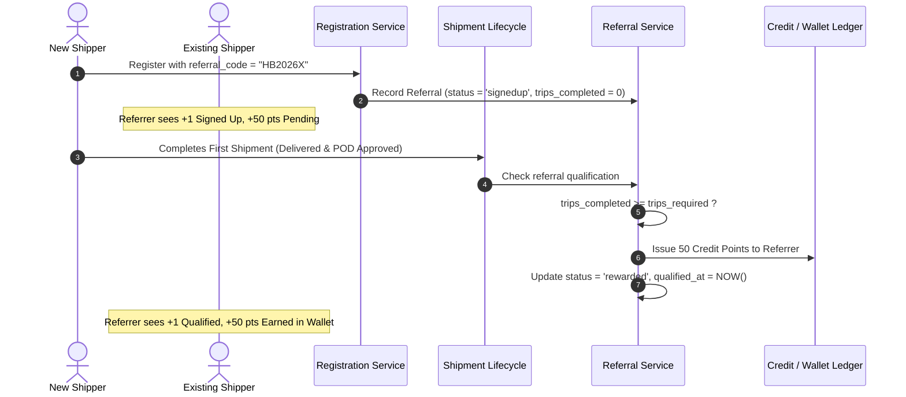

# Technical Specification & Phase-Wise Implementation Plan
## Ticket: Shipper UI Revamp — Refer MYVAGON

- **Document Version:** 1.0.0
- **Target Systems:** Frontend (`shipper_react`) & Backend (`MV_Backend_API`)
- **Status:** Draft / Ready for Implementation

---

## 1. Executive Summary & Objectives

The **Refer MYVAGON** program allows registered Shippers to share their unique referral code with other industry peers (Shippers and Forwarders) to earn platform credit points upon qualifying activity (completion of required shipments).

This document details the complete end-to-end technical plan across **Frontend** and **Backend** to implement the refined ticket requirements:
1. **Streamline "Share & Invite"**: Focus purely on the Referral Code (omit deep-linking complexity for now), adjust target audience (exclude Carriers), update share message templates, and replace SMS with **Viber**.
2. **Refine "Progress & Rewards"**: Remove the "Invited" KPI (which relies on deep links) and the bottom purple progress gauge. Retain accurate counters for **Signed Up**, **Qualified**, **Points Earned**, **Pending Points**, and **Available Credit Points Balance**.
3. **Streamline Footer & Headers**: Remove the top-right `"50 pts / referral"` badge, remove *Contact Support* and *Terms & Conditions* links, and retain *How Referrals Work*.
4. **Deliver a Robust Full-Stack Architecture**: Define the Laravel database schema, events, API endpoints, and React query integration.

---

## 2. Feature Requirements & Delta Analysis

| Component / Section | Previous Design | New Ticket Requirements | Rationale |
| :--- | :--- | :--- | :--- |
| **Modal Header** | Had top-right `"50 pts / referral"` pill badge | **Remove tag** on the top right | Keeps header minimal and prevents fixed reward assumptions. |
| **Referral Link** | Text input with copy button (`https://myvagon.com/ref/CODE`) | **Remove** for now | Deep linking tracking is non-trivial and not prioritized at this stage. |
| **Referral Code** | Text input with copy button | **Keep** & enhance copy interaction | Primary mechanism for referral attribution during registration. |
| **Audience Selector** | Shippers, Carriers, Forwarders | **Remove Carriers** (Keep Shippers & Forwarders) | Shippers refer client/forwarder networks, not carriers. |
| **Share Channels** | Email, WhatsApp, SMS, LinkedIn | **Replace SMS with Viber** (Keep Email, WhatsApp, LinkedIn) | Viber is heavily utilized in Greece & regional European logistics. |
| **Invited KPI** | Displayed count of invited contacts | **Remove** | No deep link tracking exists prior to signup. |
| **Signed Up KPI** | Count of signed up users | **Keep** | Increments when a new user registers using this account's code. |
| **Qualified KPI** | Count of qualified referrals | **Keep** | Increments once a signed-up referee completes required shipment count. |
| **Points Earned** | Earned credit points | **Keep** | Total points awarded for qualified referrals. |
| **Pending Points** | Points pending qualification | **Keep** | Points tied to signed-up users who haven't completed required trips. |
| **Credit Balance** | Gradient Available Credit Balance | **Keep** | Real-time wallet credit point balance. |
| **Progress Gauge** | Purple track with fill % | **Remove** | Simplifies visual presentation without arbitrary cap limits. |
| **Modal Footer** | How it works, Contact support, Terms & conditions | **Keep only "How referrals work"** (Remove Contact Support & Terms) | Eliminates dead/unnecessary external links. |

---

## 3. UI/UX & Frontend Design Specification (`shipper_react`)

### 3.1 Modal Header
- **Title**: `Refer MYVAGON` (`Σύσταση MYVAGON`)
- **Subtitle**: `Earn Credit Points — credits apply to subscription & commission invoices` (`Κερδίστε Πόντους Πίστωσης — οι πιστώσεις ισχύουν για τιμολόγια συνδρομής & προμήθειας`)
- **Action**: Close button (`X`) and backdrop/ESC dismiss.
- **Removed**: Top-right `"50 pts / referral"` badge.

### 3.2 "Share & Invite" Card
1. **Referral Code Box**:
   - Monospace input displaying user's `referral_code` (e.g., `HB2026X`).
   - "Copy" button triggering clipboard copy and toast notification: `✅ Code copied to clipboard`.
2. **Audience Dropdown**:
   - Options:
     - `Share to: Shippers` (`Κοινοποίηση σε: Φορτωτές`)
     - `Share to: Forwarders` (`Κοινοποίηση σε: Διαμεταφορείς`)
3. **Copy Referral Message Button**:
   - Generates text including the user's referral code and registration instructions without deep links.
4. **Share Channel Buttons**:
   - **Email**: `mailto:?subject=...&body=...`
   - **WhatsApp**: `https://wa.me/?text=...`
   - **Viber**: `viber://forward?text=...` (with fallback to `https://invite.viber.com` or web intent)
   - **LinkedIn**: `https://www.linkedin.com/sharing/share-offsite/`

### 3.3 "Progress & Rewards" Card
1. **Stats Grid (2 KPI Boxes)**:
   - **Signed Up**: Total count of registered referees using this code.
   - **Qualified**: Referees who met the trip threshold.
2. **Reward Boxes (2 Cards)**:
   - **Earned**: Green card showing total credited points (e.g., `150 pts`).
   - **Pending**: Amber card showing unearned points for active signups (e.g., `50 pts`).
3. **Available Credit Balance**:
   - Gradient green card with coin/award icon and current balance (e.g., `150 pts`).
4. **Motivational Nudge**:
   - Clean alert box informing how many qualifying shipments or referees are needed for next reward milestone.

### 3.4 Referral Activity Table
- **Filter Pills**: `All`, `Signed Up`, `Qualified`, `Rewarded`.
- **Row Columns**:
  - Avatar initials & masked company name (e.g., `Trans*** Logistics`).
  - Signup date / Qualification date.
  - Status badge: `Signed Up` (Amber), `Qualified` (Purple), `Reward Issued` (Green), `Rejected` (Red).
  - Reward Points: `+50 pts` or `50 pts pending`.

### 3.5 How It Works Accordion & Footer
- **Accordion Toggle**: `How does the referral program work?`
- **4 Steps**:
  1. *Share Your Code*: Share your unique referral code with business peers.
  2. *They Sign Up*: They enter your code during registration on MYVAGON.
  3. *They Complete Shipments*: Referral qualifies when they complete the required shipment volume.
  4. *You Earn Credits*: Credit points are added to your wallet balance.
- **Footer**: Single link to scroll/open *How referrals work*.

---

## 4. Backend Architecture & Data Flow (`MV_Backend_API`)

### 4.1 Database Design

#### Existing / Enhanced `referrals` Table:
```sql
CREATE TABLE `referrals` (
  `id` BIGINT UNSIGNED AUTO_INCREMENT PRIMARY KEY,
  `referralable_id` BIGINT UNSIGNED NOT NULL COMMENT 'Referrer Shipper ID',
  `referralable_type` VARCHAR(191) NOT NULL DEFAULT 'App\\Models\\Shipper',
  `refereeable_id` BIGINT UNSIGNED NOT NULL COMMENT 'Referred Shipper/User ID',
  `refereeable_type` VARCHAR(191) NOT NULL DEFAULT 'App\\Models\\Shipper',
  `referral_code` VARCHAR(50) NOT NULL,
  `status` ENUM('signedup', 'qualified', 'rewarded', 'rejected') NOT NULL DEFAULT 'signedup',
  `trips_completed` INT UNSIGNED NOT NULL DEFAULT 0,
  `trips_required` INT UNSIGNED NOT NULL DEFAULT 1,
  `points_reward` DECIMAL(10,2) NOT NULL DEFAULT 50.00,
  `qualified_at` TIMESTAMP NULL,
  `rewarded_at` TIMESTAMP NULL,
  `notes` TEXT NULL,
  `created_at` TIMESTAMP NULL,
  `updated_at` TIMESTAMP NULL,
  `deleted_at` TIMESTAMP NULL,
  INDEX `idx_referralable` (`referralable_type`, `referralable_id`),
  INDEX `idx_refereeable` (`refereeable_type`, `refereeable_id`),
  INDEX `idx_status` (`status`)
);
```

#### Settings in `referrals_settings` or Config:
- `points_per_referral`: Default `50`
- `max_points_cap`: Default `200` (or configurable)
- `required_completed_shipments`: Default `1` (or `3` depending on tier)
- `credit_validity_days`: Default `null` (never expire)

---

### 4.2 REST API Specification

#### 1. Get Referral Summary
- **Route:** `GET /api/v1/shipper/referrals/summary`
- **Headers:** `Authorization: Bearer <token>`, `Accept: application/json`
- **Response (200 OK):**
```json
{
  "status": true,
  "data": {
    "referral_code": "HB2026X",
    "stats": {
      "signed_up_count": 5,
      "qualified_count": 3,
      "points_earned": 150,
      "points_pending": 50,
      "available_credit_balance": 150
    },
    "program_rules": {
      "points_per_referral": 50,
      "max_points_cap": 200,
      "required_shipments": 1
    }
  }
}
```

#### 2. Get Referral Activity List
- **Route:** `GET /api/v1/shipper/referrals/activity`
- **Query Parameters:**
  - `status`: `all` | `signedup` | `qualified` | `rewarded`
  - `page`: integer (default `1`)
  - `per_page`: integer (default `10`)
- **Response (200 OK):**
```json
{
  "status": true,
  "data": {
    "items": [
      {
        "id": 1,
        "display_name_masked": "Trans*** Logistics",
        "signup_at": "2026-01-07",
        "qualified_at": "2026-01-18",
        "status": "rewarded",
        "reward_points": 50,
        "trips_completed": 1,
        "trips_required": 1
      },
      {
        "id": 2,
        "display_name_masked": "user***@cargo.eu",
        "signup_at": "2026-02-04",
        "qualified_at": null,
        "status": "signedup",
        "reward_points": 50,
        "trips_completed": 0,
        "trips_required": 1
      }
    ],
    "pagination": {
      "total": 5,
      "page": 1,
      "per_page": 10,
      "last_page": 1
    }
  }
}
```

---

### 4.3 Backend Event Lifecycle & Automation



---

## 5. Step-by-Step Phase-Wise Implementation Roadmap

### Phase 1: Frontend UI/UX Alignment (`shipper_react`)
- [x] Update [ReferralModal.tsx](file:///c:/xampp/htdocs/MYVAGON/shipper_react/src/components/referral/ReferralModal.tsx):
  - Remove header `"50 pts / referral"` badge.
  - Remove Referral Link input row.
  - Remove `"Share to: Carriers"` from audience selector.
  - Replace SMS sharing button with **Viber** (`viber://forward?text=...`).
  - Update pre-composed share message templates (English & Greek) to remove placeholder URLs and highlight the Referral Code.
  - Remove `"Invited"` counter from the stats grid (now displaying 2 KPIs: Signed Up & Qualified).
  - Remove the purple progress bar/gauge at the bottom of the Progress card.
  - Clean up footer: keep only *How referrals work*, remove *Contact support* and *Terms & conditions*.
- [x] Update [referral-modal.css](file:///c:/xampp/htdocs/MYVAGON/shipper_react/src/styles/referral-modal.css) to support the streamlined layout.
- [x] Update locale files ([en.json](file:///c:/xampp/htdocs/MYVAGON/shipper_react/src/locale/en.json) & [el.json](file:///c:/xampp/htdocs/MYVAGON/shipper_react/src/locale/el.json)).

### Phase 2: Backend Core Service & Data Mapping (`MV_Backend_API`)
- [x] Created [ShipperReferralService.php](file:///c:/xampp/htdocs/MYVAGON/MV_Backend_API/app/Services/Shipper/ShipperReferralService.php):
  - `summary(Shipper $shipper)`: dynamically computes signed up count, qualified count, points earned, pending points, wallet credit balance, and program rules.
  - `activity(Shipper $shipper, $filter, $page, $perPage)`: dynamically fetches referee list with privacy masking, signup/qualification timestamps, status, and points.
  - Auto-provisions dynamic referral codes for shippers if not already present.

### Phase 3: Backend Controller & Routing (`MV_Backend_API`)
- [x] Created [ReferralSummaryController.php](file:///c:/xampp/htdocs/MYVAGON/MV_Backend_API/app/Http/Controllers/Api/Shipper/V1/Referral/ReferralSummaryController.php).
- [x] Created [ReferralActivityController.php](file:///c:/xampp/htdocs/MYVAGON/MV_Backend_API/app/Http/Controllers/Api/Shipper/V1/Referral/ReferralActivityController.php).
- [x] Registered routes in [routes/api/shipper.php](file:///c:/xampp/htdocs/MYVAGON/MV_Backend_API/routes/api/shipper.php):
  - `GET /api/v1/shipper/referrals/summary`
  - `GET /api/v1/shipper/referrals/activity`

### Phase 4: Frontend API Integration & React Query (`shipper_react`)
- [x] Created [referralService.ts](file:///c:/xampp/htdocs/MYVAGON/shipper_react/src/api/services/referralService.ts) for authenticated API calls.
- [x] Created [useReferral.ts](file:///c:/xampp/htdocs/MYVAGON/shipper_react/src/hooks/useReferral.ts) React Query hooks (`useReferralSummary`, `useReferralActivity`).
- [x] Connected [ReferralModal.tsx](file:///c:/xampp/htdocs/MYVAGON/shipper_react/src/components/referral/ReferralModal.tsx) to live hooks with loading spinner, filtering, and seamless error/fallback handling.


### Phase 5: Verification & Quality Assurance
- [ ] Frontend build verification (`npm.cmd run build` / `tsc -b`).
- [ ] Test Viber URL scheme and share triggers on mobile/desktop.
- [ ] Test copy-to-clipboard on HTTPS / HTTP environments.
- [ ] Test end-to-end referral cycle: Sign up with code -> complete shipment -> points credited in wallet.
- [ ] Verify Greek (ΕΛ) and English (EN) language parity.

---

## 6. Verification Checklist

| Item | Requirement | Verification Method |
| :--- | :--- | :--- |
| **Header Badge** | Tag `"50 pts / referral"` removed | Visual inspection of modal top-right |
| **Referral Link** | Link input removed | Only Referral Code input exists with Copy button |
| **Carrier Option** | `"Share to: Carriers"` removed | Dropdown has only Shippers & Forwarders |
| **Viber Share** | SMS button replaced with Viber | Clicking opens Viber URL handler with prefilled code text |
| **Invited KPI** | "Invited" card removed | Progress section displays Signed Up and Qualified |
| **Purple Track** | Bottom progress bar removed | Progress section is clean and streamlined |
| **Footer Links** | Support & Terms removed | Only *How referrals work* remains |
| **Translations** | EN & EL full coverage | Toggle language switch and verify all strings |
| **Build Test** | Zero TypeScript / Vite compilation errors | `npm.cmd run build` returns code `0` |
